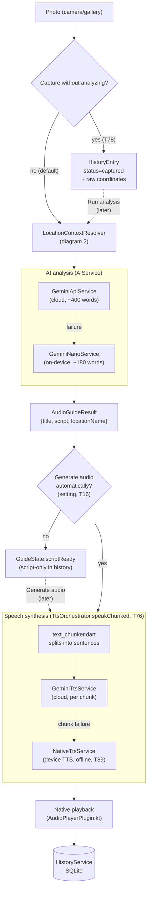
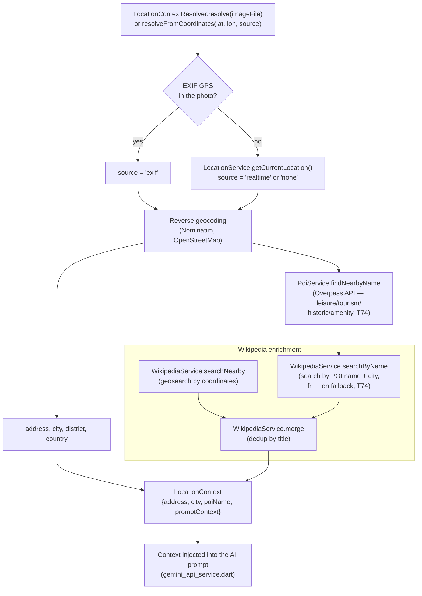
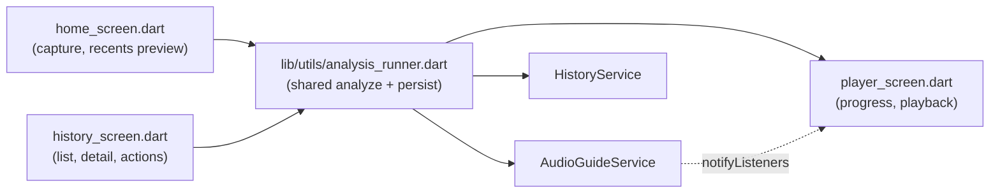

# Architecture — AudioLens

Overview of the pipeline and data flows, to get oriented quickly in the
code (T69). For task status, see [`TODO.md`](TODO.md) and
[`CHANGELOG.md`](CHANGELOG.md).

## Overview

AudioLens turns a photo of a place into an audio commentary: an image is
located (GPS), enriched with factual context (Wikipedia, point of
interest), analyzed by an AI model (vision), then the resulting script is
synthesized into speech and played.

Two entry paths exist:
- **Immediate analysis** (default): photo → full pipeline → audio.
- **Deferred capture** (T78): photo + raw GPS coordinates saved with no
  network call at all; the rest of the pipeline (reverse geocoding, POI,
  Wikipedia, AI, TTS) is triggered later, on demand, from the history
  screen — useful to save mobile data.

## Diagram 1 — Main pipeline: Photo → AIService → TTS → Audio

**Key points**:
- `AudioGuideService.analyzeAndPlay()` (`audio_guide_service.dart`)
  orchestrates the whole pipeline and notifies the UI via `GuideState`
  (`idle → locating → analyzing → synthesizing → speaking`, plus
  `scriptReady`, `paused`, `cancelling`, `error`).
- The cloud → local fallback exists at two independent levels: AI (Gemini
  API → Gemini Nano) and TTS (Gemini TTS → native Android TTS). An AI
  failure does not trigger a TTS fallback, and vice versa.
- `TtsOrchestrator.speakChunked()` synthesizes the next chunk while the
  current one plays (instead of waiting for the full script to be
  synthesized before starting playback). If a chunk fails to synthesize,
  the native TTS fallback only covers the remaining text — already-played
  chunks are not replayed.
- `CancelToken` (`lib/utils/cancel_token.dart`) is checked between each
  pipeline step and between each TTS chunk, and (T70) is also bridged to
  a `dio.CancelToken` per request, so cancelling genuinely aborts an
  already in-flight HTTP call instead of just abandoning the wait for it.
- A `style` parameter (T75, `immersive`/`academic`/`anecdotal`/`concise`)
  flows from `SettingsService` into the AI prompt (both `GeminiApiService`
  and `GeminiNanoPlugin.kt`), and a `speed` multiplier (T15) flows into
  both TTS engines at playback time — neither is cached engine-side
  state, both are threaded as plain parameters on each call.
- While `analyzeAndPlay()`/`generateAudioForScript()` run, a native
  foreground service (`AnalysisForegroundService.kt`, T85) protects the
  app process from being killed while backgrounded, and a local
  notification (`AudioReadyNotifier`) reports success/failure once the
  user isn't actively looking at the app.

## Diagram 2 — Geolocation: EXIF → GPS → Wikipedia

**Key points**:
- For a deferred capture (T78), only the raw coordinates are saved when
  the photo is taken (no network call); this entire diagram runs later,
  when "Run analysis" is triggered, via `resolveFromCoordinates()`.
- The Wikipedia search radius (`wikipedia_radius_meters`, 500 m by
  default) and POI radius (`poi_radius_meters`, 75 m) are driven by
  [`config.json`](config.json), fetched remotely by `RemoteConfigService`
  with a domain allowlist (T81) and built-in defaults as a fallback.
- `PoiService` picks the closest POI by Haversine distance (Overpass's
  return order is not guaranteed to be distance-sorted).

## Persistence

| Data | Service | Storage |
|---|---|---|
| Analysis history | `HistoryService` | SQLite (`sqflite`) |
| Gemini API key | `SecureKeyStorage` | Encrypted Keystore/Keychain (`flutter_secure_storage`), with a one-shot migration from the old `SharedPreferences` |
| Active provider, timing history | `GuidePreferencesStore` | `SharedPreferences` |
| Settings (auto audio, Ko-fi button...) | `SettingsService` | `SharedPreferences` |
| Remote config (models, radii, TTS...) | `RemoteConfigService` | Network fetch + in-code defaults |

`HistoryEntry.status` (`AnalysisStatus`) has four values: `pending`
(analysis in progress), `captured` (photo + GPS saved, analysis not
started — T78), `complete`, `failed`. A `complete` entry with no
`audioPath` means "script only" (T16) — audio can be generated later
without redoing GPS/Wikipedia/AI.

## Native channels (MethodChannel, Android/Kotlin)

| Channel | Kotlin plugin | Role |
|---|---|---|
| `audio_guide/location` | `LocationPlugin.kt` | Permission + real-time GPS fix |
| `audio_guide/audio_player` | `AudioPlayerPlugin.kt` | Gemini TTS's WAV playback, with speed control (T15) |
| `audio_guide/gemini_nano` | `GeminiNanoPlugin.kt` | On-device AI analysis (Google AI Core) |
| `audio_guide/foreground_service` | `ForegroundServicePlugin.kt` | Starts/stops `AnalysisForegroundService` (T85) |

Native Android TTS (the local fallback) goes through the `flutter_tts`
plugin directly, not a hand-rolled channel — see `NativeTtsService`.

`AudioPlayerPlugin.kt` resolves its `playWav` call only once playback
finishes (or is stopped) — that's what lets `TtsOrchestrator` sequence
chunks on the Dart side without any native queueing logic.

## Screens → services

`analysis_runner.dart` centralizes the "run the analysis, persist the
result to history, navigate to the playback screen" sequence — shared by
a new photo, a retry, and launching a deferred analysis (T78).
