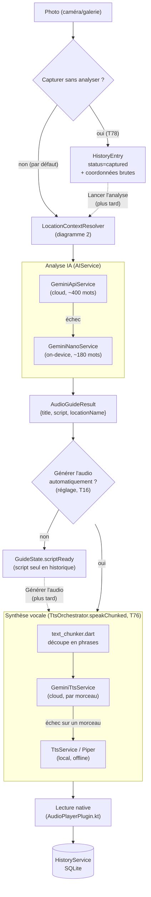
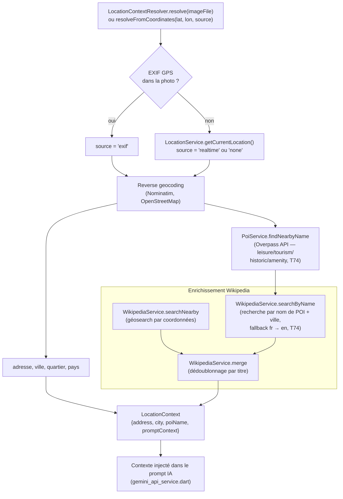
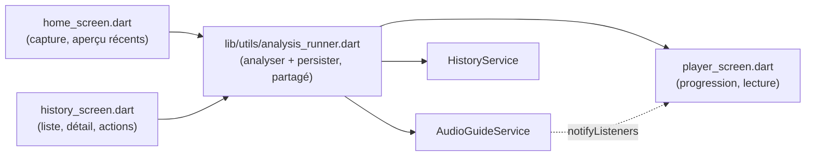

# Architecture — AudioLens

Vue d'ensemble du pipeline et des flux, pour s'orienter rapidement dans le
code (T69). Pour l'état des tâches, voir [`TODO.md`](TODO.md) et
[`CHANGELOG.md`](CHANGELOG.md).

## Vue d'ensemble

AudioLens transforme une photo de lieu en un commentaire audio : une image
est localisée (GPS), enrichie avec du contexte factuel (Wikipedia, point
d'intérêt), analysée par un modèle IA (vision), puis le script produit est
synthétisé en voix et joué.

Deux chemins d'entrée existent :
- **Analyse immédiate** (par défaut) : photo → pipeline complet → audio.
- **Capture différée** (T78) : photo + coordonnées GPS brutes enregistrées
  sans aucun appel réseau ; le reste du pipeline (reverse geocoding, POI,
  Wikipedia, IA, TTS) est lancé plus tard, à la demande, depuis l'historique
  — utile pour économiser sa connexion data.

## Diagramme 1 — Pipeline principal : Photo → AIService → TTS → Audio

**Points clés** :
- `AudioGuideService.analyzeAndPlay()` (`audio_guide_service.dart`) orchestre
  tout le pipeline et notifie l'UI via `GuideState`
  (`idle → locating → analyzing → synthesizing → speaking`, plus
  `scriptReady`, `paused`, `cancelling`, `error`).
- Le repli cloud → local existe à deux niveaux indépendants : IA (Gemini API
  → Gemini Nano) et TTS (Gemini TTS → Piper). Un échec IA ne déclenche pas de
  repli TTS et inversement.
- `TtsOrchestrator.speakChunked()` synthétise le morceau suivant pendant que
  le morceau courant joue (au lieu d'attendre la synthèse complète du script
  avant de commencer la lecture). En cas d'échec de synthèse d'un morceau,
  le repli Piper ne reprend que le texte restant — les morceaux déjà joués
  ne sont pas rejoués.
- `CancelToken` (`lib/utils/cancel_token.dart`) est vérifié entre chaque
  étape du pipeline et entre chaque morceau TTS ; il n'interrompt pas un
  appel HTTP déjà en cours (le package `http` ne le permet pas — voir T70).

## Diagramme 2 — Géolocalisation : EXIF → GPS → Wikipedia

**Points clés** :
- Pour une capture différée (T78), seules les coordonnées brutes sont
  enregistrées à la prise de photo (aucun appel réseau) ; tout ce diagramme
  s'exécute plus tard, au moment de "Lancer l'analyse", via
  `resolveFromCoordinates()`.
- Le rayon de recherche Wikipedia (`wikipedia_radius_meters`, 500 m par
  défaut) et POI (`poi_radius_meters`, 75 m) sont pilotés par
  [`config.json`](config.json), chargé à distance par `RemoteConfigService`
  avec allowlist de domaine (T81) et valeurs par défaut intégrées en secours.
- `PoiService` sélectionne le POI le plus proche par distance de Haversine
  (l'ordre de retour d'Overpass n'est pas garanti par distance).

## Persistance

| Donnée | Service | Stockage |
|---|---|---|
| Historique des analyses | `HistoryService` | SQLite (`sqflite`) |
| Clé API Gemini | `SecureKeyStorage` | Keystore/Keychain chiffré (`flutter_secure_storage`), avec migration one-shot depuis l'ancien `SharedPreferences` |
| Provider actif, historique de timing | `GuidePreferencesStore` | `SharedPreferences` |
| Réglages (audio auto, bouton Ko-fi...) | `SettingsService` | `SharedPreferences` |
| Config distante (modèles, rayons, TTS...) | `RemoteConfigService` | Fetch réseau + valeurs par défaut en code |

`HistoryEntry.status` (`AnalysisStatus`) a quatre valeurs : `pending`
(analyse en cours), `captured` (photo + GPS enregistrés, analyse non
lancée — T78), `complete`, `failed`. Une entrée `complete` sans `audioPath`
signifie "script seul" (T16) — l'audio peut être généré plus tard sans
refaire GPS/Wikipedia/IA.

## Canaux natifs (MethodChannel, Android/Kotlin)

| Channel | Plugin Kotlin | Rôle |
|---|---|---|
| `audio_guide/location` | `LocationPlugin.kt` | Permission + fix GPS temps réel |
| `audio_guide/audio_player` | `AudioPlayerPlugin.kt` | Lecture WAV (Piper et Gemini TTS partagent le même lecteur natif) |
| `audio_guide/gemini_nano` | `GeminiNanoPlugin.kt` | Analyse IA on-device (Google AI Core) |

`AudioPlayerPlugin.kt` résout son appel `playWav` seulement quand la lecture
se termine (ou est arrêtée) — c'est ce qui permet à `TtsOrchestrator` de
séquencer les morceaux côté Dart sans logique de file d'attente native.

## Écrans → services

`analysis_runner.dart` centralise la séquence "lancer l'analyse, persister
le résultat en historique, naviguer vers l'écran de lecture" — utilisée à la
fois pour une nouvelle photo, une nouvelle tentative, et le lancement d'une
analyse différée (T78).
