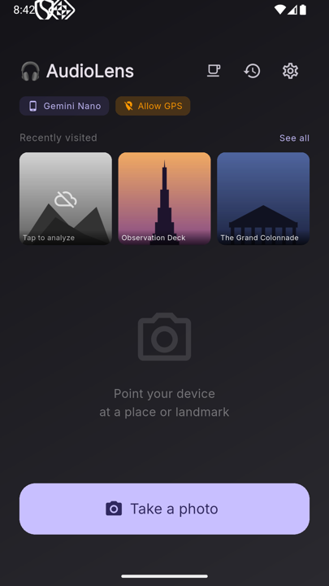
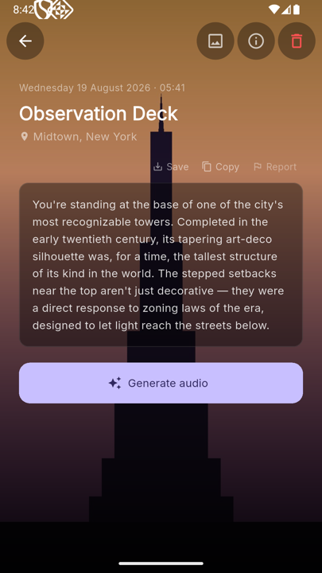
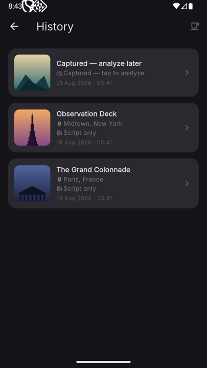

# 🎧 AudioLens

An AI-powered audio guide mobile app. Take a photo of a place and instantly get an audio explanation.

**[📄 Project site & screenshots](https://nohzoh.github.io/AudioLens/)** · [ARCHITECTURE.md](ARCHITECTURE.md) · [CONTRIBUTING.md](CONTRIBUTING.md)

<p align="center">
  
  
  
</p>

<sup>Screenshots show example content used to illustrate the interface, not live captures.</sup>

## Features

- 📸 Photo capture to identify places
- 🗺️ Smart geolocation: photo **EXIF** coordinates, then **real-time GPS** as a fallback
- 📖 **Wikipedia** enrichment to add context to the place
- 🤖 AI analysis: **Gemini API** (cloud) or **Gemini Nano** (local, on-device)
- 🔊 Audio generation: **Gemini TTS** (cloud) with the device's **native Android TTS** as a fallback (offline, female/male voice choice)
- 🎚️ **Script style** (immersive, academic, anecdotal, concise) and **playback speed** (0.75x–1.5x), both configurable
- 📶 **Background-safe analysis**: a foreground service keeps the analysis alive while the app is backgrounded, with a notification when the audio is ready (or if it failed)
- 🧭 Location detection: the device needs coordinate access if the photo has no EXIF
- 📜 Analysis **history** (SQLite) with replay and retry
- 🧾 **Analysis detail sheet** (model, fallback, GPS, duration)
- 📋 Built-in **logs screen** for field debugging
- 🆓 **Ko-fi** button to support the project

## Architecture

```
Photo → EXIF GPS → Real-time GPS → Wikipedia → AI (vision) → LLM (script) → TTS → Audio
```

Pipeline details and diagrams in [`ARCHITECTURE.md`](ARCHITECTURE.md).

### Available modes
- **☁️ Cloud**: Uses your **Google account (Gemini API)** — best quality (~400 words)
- **📱 Local**: On-device **Gemini Nano** model — works without internet (~180 words)
- **⚡ Hybrid**: Cloud when available, **local fallback** otherwise

### AI providers
| Provider | Location | Model |
|---|---|---|
| **Gemini API** | Cloud | Configurable (`config.json`, default `gemini-3.6-flash`) |
| **Gemini Nano** | On-device | Local Android model |

### Text-to-Speech
| Engine | Location | Role |
|---|---|---|
| **Gemini TTS** | Cloud | Primary when an API key is configured |
| **Native Android TTS** | Local | Automatic fallback + offline mode, female/male voice choice |

## Platforms

**Android** only. Automatically built via **GitHub Actions** on every push to `main`.

## Build

```bash
flutter pub get
flutter build apk --debug
```

## Configuration

Configuration (models, fallbacks, TTS, GPS) is centralized in [`config.json`](config.json) and fetched remotely by `RemoteConfigService`, with built-in defaults as a fallback.

## License

[AGPL-3.0](LICENSE)
